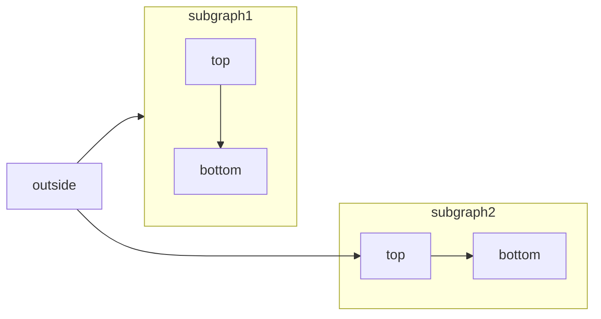

# Headers and text

> Learn how to format text, create headers, and style content

## Headers

Headers organize your content and create navigation anchors. They appear in the table of contents and help users scan your documentation.

### Creating headers

Use `#` symbols to create headers of different levels:

```mdx
## Main section header
### Subsection header
#### Sub-subsection header
```

<Tip>
  Use descriptive, keyword-rich headers that clearly indicate the content that follows. This improves both user navigation and search engine optimization.
</Tip>

### Disabling anchor links

By default, headers include clickable anchor links that allow users to link directly to specific sections. You can disable these anchor links using the `noAnchor` prop in HTML or React headers.

<CodeGroup>
  ```mdx HTML header example
  <h2 noAnchor>
  Header without anchor link
  </h2>
  ```

  ```mdx React header example
  <Heading level={2} noAnchor>
  Header without anchor link
  </Heading>
  ```
</CodeGroup>

When `noAnchor` is used, the header will not display the anchor chip and clicking the header text will not copy the anchor link to the clipboard.

## Text formatting

We support most Markdown formatting for emphasizing and styling text.

### Basic formatting

Apply these formatting styles to your text:

| Style             | Syntax     | Example                | Result                 |
| ----------------- | ---------- | ---------------------- | ---------------------- |
| **Bold**          | `**text**` | `**important note**`   | **important note**     |
| *Italic*          | `_text_`   | `_emphasis_`           | *emphasis*             |
| ~~Strikethrough~~ | `~text~`   | `~deprecated feature~` | ~~deprecated feature~~ |

### Combining formats

You can combine formatting styles:

```mdx
**_bold and italic_**
**~~bold and strikethrough~~**
*~~italic and strikethrough~~**
```

***bold and italic***<br />
**~~bold and strikethrough~~**<br />
*~~italic and strikethrough~~*

### Superscript and subscript

For mathematical expressions or footnotes, use HTML tags:

| Type        | Syntax            | Example               | Result              |
| ----------- | ----------------- | --------------------- | ------------------- |
| Superscript | `<sup>text</sup>` | `example<sup>2</sup>` | example<sup>2</sup> |
| Subscript   | `<sub>text</sub>` | `example<sub>n</sub>` | example<sub>n</sub> |

## Links

Links help users navigate between pages and access external resources. Use descriptive link text to improve accessibility and user experience.

### Internal links

Link to other pages in your documentation using root-relative paths:

```mdx
[Quickstart](/quickstart)
[Steps](/components/steps)
```

[Quickstart](/quickstart)<br />
[Steps](/components/steps)

<Note>
  Avoid relative links like `[page](../page)` as they load slower and cannot be optimized as effectively as root-relative links.
</Note>

### External links

For external resources, include the full URL:

```mdx
[Markdown Guide](https://www.markdownguide.org/)
```

[Markdown Guide](https://www.markdownguide.org/)

### Broken links

You can check for broken links in your documentation using the [CLI](/installation):

```bash
mint broken-links
```

## Blockquotes

Blockquotes highlight important information, quotes, or examples within your content.

### Single line blockquotes

Add `>` before text to create a blockquote:

```mdx
> This is a quote that stands out from the main content.
```

> This is a quote that stands out from the main content.

### Multi-line blockquotes

For longer quotes or multiple paragraphs:

```mdx
> This is the first paragraph of a multi-line blockquote.
>
> This is the second paragraph, separated by an empty line with `>`.
```

> This is the first paragraph of a multi-line blockquote.
>
> This is the second paragraph, separated by an empty line with `>`.

<Tip>
  Use blockquotes sparingly to maintain their visual impact and meaning. Consider using [callouts](/components/callouts) for notes, warnings, and other information.
</Tip>

## Mathematical expressions

We support LaTeX for rendering mathematical expressions and equations.

### Inline math

Use single dollar signs, `$`, for inline mathematical expressions:

```mdx
The Pythagorean theorem states that $(a^2 + b^2 = c^2)$ in a right triangle.
```

The Pythagorean theorem states that $(a^2 + b^2 = c^2)$ in a right triangle.

### Block equations

Use double dollar signs, `$$`, for standalone equations:

```mdx
$$
E = mc^2
$$
```

$$
E = mc^2
$$

<Info>
  LaTeX support requires proper mathematical syntax. Refer to the [LaTeX documentation](https://www.latex-project.org/help/documentation/) for comprehensive syntax guidelines.
</Info>

## Line breaks and spacing

Control spacing and line breaks to improve content readability.

### Paragraph breaks

Separate paragraphs with blank lines:

```mdx
This is the first paragraph.

This is the second paragraph, separated by a blank line.
```

This is the first paragraph.

This is the second paragraph, separated by a blank line.

### Manual line breaks

Use HTML `<br />` tags for forced line breaks within paragraphs:

```mdx
This line ends here.<br />
This line starts on a new line.
```

This line ends here.<br />
This line starts on a new line.

<Tip>
  In most cases, paragraph breaks with blank lines provide better readability than manual line breaks.
</Tip>

## Best practices

### Content organization

* Use headers to create clear content hierarchy
* Follow proper header hierarchy (don't skip from H2 to H4)
* Write descriptive, keyword-rich header text

### Text formatting

* Use bold for emphasis, not for entire paragraphs
* Reserve italics for terms, titles, or subtle emphasis
* Avoid over-formatting that distracts from content

### Links

* Write descriptive link text instead of "click here" or "read more"
* Use root-relative paths for internal links
* Test links regularly to prevent broken references
# Images and embeds

> Add images, videos, and iframes

Add images, embed videos, and include interactive content with iframes to your documentation.

All static assets in your docs repository are automatically served at the appropriate path on your domain. For example, if you have `/images/my-logo.png` in your repo, the image will be available at `https://docs.yoursite.com/images/my-logo.png`.

<Frame>
  
</Frame>

## Images

Add images to provide visual context, examples, or decoration to your documentation.

### Basic image syntax

Use [Markdown syntax](https://www.markdownguide.org/basic-syntax/#images) to add images to your documentation:

```mdx

```

<Tip>
  Always include descriptive alt text to improve accessibility and SEO. The alt text should clearly describe what the image shows.
</Tip>

Image files must be less than 20MB. For larger files, host them on a CDN service like [Amazon S3](https://aws.amazon.com/s3) or [Cloudinary](https://cloudinary.com).

### HTML image embeds

For more control over image display, use HTML `` tags:

```html

```

#### Disable zoom functionality

To disable the default zoom on click for images, add the `noZoom` property:

```html highlight="4"

```

#### Link images

To make an image a clickable link, wrap the image in an anchor tag and add the `noZoom` property:

```html
<a href="https://mintlify.com" target="_blank">
  
</a>
```

<Note>
  Images within anchor tags automatically display a pointer cursor to indicate they are clickable.
</Note>

#### Light and dark mode images

To display different images for light and dark themes, use Tailwind CSS classes:

```html
<!-- Light mode image -->


<!-- Dark mode image -->

```

## Videos

Mintlify supports [HTML tags in Markdown](https://www.markdownguide.org/basic-syntax/#html), giving you flexibility to create rich content.

<Tip>
  Always include fallback text content within video elements for browsers that don't support video playback.
</Tip>

### YouTube embeds

Embed YouTube videos using iframe elements:

```html
<iframe
  className="w-full aspect-video rounded-xl"
  src="https://www.youtube.com/embed/4KzFe50RQkQ"
  title="YouTube video player"
  frameBorder="0"
  allow="accelerometer; autoplay; clipboard-write; encrypted-media; gyroscope; picture-in-picture"
  allowFullScreen
></iframe>
```

<Frame>
  <iframe className="w-full aspect-video rounded-xl" src="https://www.youtube.com/embed/4KzFe50RQkQ" title="YouTube video player" frameBorder="0" allow="accelerometer; autoplay; clipboard-write; encrypted-media; gyroscope; picture-in-picture" allowFullScreen />
</Frame>

### Self-hosted videos

Use the HTML `<video>` element for self-hosted video content:

```html
<video
  controls
  className="w-full aspect-video rounded-xl"
  src="link-to-your-video.com"
></video>
```

### Autoplay videos

To autoplay a video, use:

```html
<video
  autoPlay
  muted
  loop
  playsInline
  className="w-full aspect-video rounded-xl"
  src="/videos/demo.mp4"
></video>
```

<Note>
  When using JSX syntax, write double-word attributes in camelCase: `autoPlay`, `playsInline`, `allowFullScreen`.
</Note>

## iframes

Embed external content using iframe elements:

```html
<iframe 
  src="https://example.com/embed" 
  title="Embedded content"
  className="w-full h-96 rounded-xl"
></iframe>
```

## Related resources

<Card title="Frame component reference" icon="frame" horizontal href="/components/frames">
  Learn how to use the Frame component for presenting images.
</Card>
# Lists and tables

> Display information in lists and tables

## Lists

Lists follow the official [Markdown syntax](https://www.markdownguide.org/basic-syntax/#lists-1).

### Ordered list

To create an ordered list, add numbers followed by a period before list items.

1. First item
2. Second item
3. Third item
4. Fourth item

```mdx
1. First item
2. Second item
3. Third item
4. Fourth item
```

### Unordered list

To create an unordered list, add dashes (`-`), asterisks (`*`), or plus signs (`+`) before list items.

* First item
* Second item
* Third item
* Fourth item

```mdx
- First item
- Second item
- Third item
- Fourth item
```

### Nested list

Indent list items to nest them.

* First item
* Second item
  * Additional item
  * Additional item
* Third item

```mdx
- First item
- Second item
  - Additional item
  - Additional item
- Third item
```

## Tables

Tables follow the official [Markdown syntax](https://www.markdownguide.org/extended-syntax/#tables).

To add a table, use three or more hyphens (`---`) to create each column's header, and use pipes (`|`) to separate each column. For compatibility, you should also add a pipe on either end of the row.

| Property | Description                           |
| -------- | ------------------------------------- |
| Name     | Full name of user                     |
| Age      | Reported age                          |
| Joined   | Whether the user joined the community |

```mdx
| Property | Description                           |
| -------- | ------------------------------------- |
| Name     | Full name of user                     |
| Age      | Reported age                          |
| Joined   | Whether the user joined the community |
```
# Code

> Display inline code and code blocks

## Adding code samples

You can add inline code snippets or code blocks. Code blocks support meta options for syntax highlighting, titles, line highlighting, icons, and more.

### Inline code

To denote a `word` or `phrase` as code, enclose it in backticks (\`).

```mdx
To denote a `word` or `phrase` as code, enclose it in backticks (`).
```

### Code blocks

Use [fenced code blocks](https://www.markdownguide.org/extended-syntax/#fenced-code-blocks) by enclosing code in three backticks. Code blocks are copyable, and if you have the assistant enabled, users can ask AI to explain the code.

Specify the programming language for syntax highlighting and to enable meta options. Add any meta options, like a title or icon, after the language.

```java HelloWorld.java lines icon="java"
class HelloWorld {
    public static void main(String[] args) {
        System.out.println("Hello, World!");
    }
}
```

````mdx
```java HelloWorld.java lines icon="java"
class HelloWorld {
    public static void main(String[] args) {
        System.out.println("Hello, World!");
    }
}
```
````

## Code block options

You can add meta options to your code blocks to customize their appearance.

<Note>
  You must specify a programming language for a code block before adding any other meta options.
</Note>

### Option syntax

* **String and boolean options**: Wrap with `""`, `''`, or no quotes.
* **Expression options**: Wrap with `{}`, `""`, or `''`.

### Syntax highlighting

Enable syntax highlighting by specifying the programming language after the opening backticks of a code block.

We use [Shiki](https://shiki.style/) for syntax highlighting and support all available languages. See the full list of [languages](https://shiki.style/languages) in Shiki's documentation.

```java
class HelloWorld {
    public static void main(String[] args) {
        System.out.println("Hello, World!");
    }
}
```

````mdx
```java
class HelloWorld {
    public static void main(String[] args) {
        System.out.println("Hello, World!");
    }
}
```
````

### Title

Add a title to label your code example. Use `title="Your title"` or a string on a single line.

```javascript Code Block Example
const hello = "world";
```

````mdx
```javascript Code Block Example
const hello = "world";
```
````

### Icon

Add an icon to your code block using the `icon` property. See [Icons](/components/icons) for all available options.

```javascript icon="square-js"
const hello = "world";
```

````mdx
```javascript icon="square-js"
const hello = "world";
```
````

### Line Highlighting

Highlight specific lines in your code blocks using `highlight` with the line numbers or ranges you want to highlight.

```javascript Line Highlighting Example highlight= {1-2,5}
const greeting = "Hello, World!";
function sayHello() {
  console.log(greeting);
}
sayHello();
```

````mdx
```javascript Line Highlighting Example highlight={1-2,5}
const greeting = "Hello, World!";
function sayHello() {
  console.log(greeting);
}
sayHello();
```
````

### Line focusing

Focus on specific lines in your code blocks using `focus` with line numbers or ranges.

```javascript Line Focus Example focus= {2,4-5}
const greeting = "Hello, World!";
function sayHello() {
  console.log(greeting);
}
sayHello();
```

````mdx
```javascript Line Focus Example focus={2,4-5}
const greeting = "Hello, World!";
function sayHello() {
  console.log(greeting);
}
sayHello();
```
````

### Show line numbers

Display line numbers on the left side of your code block using `lines`.

```javascript Show Line Numbers Example lines
const greeting = "Hello, World!";
function sayHello() {
  console.log(greeting);
}
sayHello();
```

````mdx
```javascript Show Line Numbers Example lines
const greeting = "Hello, World!";
function sayHello() {
  console.log(greeting);
}
sayHello();
```
````

### Expandable

Allow users to expand and collapse long code blocks using `expandable`.

```python Expandable Example expandable
from datetime import datetime, timedelta
from typing import Dict, List, Optional
from dataclasses import dataclass

@dataclass
class Book:
    title: str
    author: str
    isbn: str
    checked_out: bool = False
    due_date: Optional[datetime] = None

class Library:
    def __init__(self):
        self.books: Dict[str, Book] = {}
        self.checkouts: Dict[str, List[str]] = {}  # patron -> list of ISBNs

    def add_book(self, book: Book) -> None:
        if book.isbn in self.books:
            raise ValueError(f"Book with ISBN {book.isbn} already exists")
        self.books[book.isbn] = book

    def checkout_book(self, isbn: str, patron: str, days: int = 14) -> None:
        if patron not in self.checkouts:
            self.checkouts[patron] = []

        book = self.books.get(isbn)
        if not book:
            raise ValueError("Book not found")

        if book.checked_out:
            raise ValueError("Book is already checked out")

        if len(self.checkouts[patron]) >= 3:
            raise ValueError("Patron has reached checkout limit")

        book.checked_out = True
        book.due_date = datetime.now() + timedelta(days=days)
        self.checkouts[patron].append(isbn)

    def return_book(self, isbn: str) -> float:
        book = self.books.get(isbn)
        if not book or not book.checked_out:
            raise ValueError("Book not found or not checked out")

        late_fee = 0.0
        if datetime.now() > book.due_date:
            days_late = (datetime.now() - book.due_date).days
            late_fee = days_late * 0.50

        book.checked_out = False
        book.due_date = None

        # Remove from patron's checkouts
        for patron, books in self.checkouts.items():
            if isbn in books:
                books.remove(isbn)
                break

        return late_fee

    def search(self, query: str) -> List[Book]:
        query = query.lower()
        return [
            book for book in self.books.values()
            if query in book.title.lower() or query in book.author.lower()
        ]

def main():
    library = Library()

    # Add some books
    books = [
        Book("The Hobbit", "J.R.R. Tolkien", "978-0-261-10295-4"),
        Book("1984", "George Orwell", "978-0-452-28423-4"),
    ]

    for book in books:
        library.add_book(book)

    # Checkout and return example
    library.checkout_book("978-0-261-10295-4", "patron123")
    late_fee = library.return_book("978-0-261-10295-4")
    print(f"Late fee: ${late_fee:.2f}")

if __name__ == "__main__":
    main()
```

````mdx
```python Expandable Example expandable
from datetime import datetime, timedelta
from typing import Dict, List, Optional
from dataclasses import dataclass

# ...

if __name__ == "__main__":
    main()
```
````

### Wrap

Enable text wrapping for long lines using `wrap`. This prevents horizontal scrolling and makes long lines easier to read.

```javascript Wrap Example wrap
const greeting = "Hello, World! I am a long line of text that will wrap to the next line.";
function sayHello() {
  console.log(greeting);
}
sayHello();
```

````mdx
```javascript Wrap Example wrap
const greeting = "Hello, World! I am a long line of text that will wrap to the next line.";
function sayHello() {
  console.log(greeting);
}
sayHello();
```
````

### Diff

Show a visual diff of added or removed lines in your code blocks. Added lines are highlighted in green and removed lines are highlighted in red.

To create diffs, add these special comments at the end of lines in your code block:

* `// [!code ++]`: Mark a line as added (green highlight).
* `// [!code --]`: Mark a line as removed (red highlight).

For multiple consecutive lines, specify the number of lines after a colon:

* `// [!code ++:3]`: Mark the current line plus the next two lines as added.
* `// [!code --:5]`: Mark the current line plus the next four lines as removed.

The comment syntax must match your programming language (for example, `//` for JavaScript or `#` for Python).

```js Diff Example icon="code" lines
const greeting = "Hello, World!"; // [!code ++]
function sayHello() {
  console.log("Hello, World!"); // [!code --]
  console.log(greeting); // [!code ++]
}
sayHello();
```

````text
```js Diff Example icon="code" lines
const greeting = "Hello, World!"; // [!code ++]
function sayHello() {
  console.log("Hello, World!"); // [!code --]
  console.log(greeting); // [!code ++]
}
sayHello();
```
````
# Reusable snippets

> Reusable, custom snippets to keep content in sync

One of the core principles of software development is DRY (Don't Repeat
Yourself), which applies to documentation as
well. If you find yourself repeating the same content in multiple places, you
should create a custom snippet to keep your content in sync.

## Creating a custom snippet

**Pre-condition**: You must create your snippet file in the `snippets` directory in order for the import to work.

Any page in the `snippets` directory will be treated as a snippet and will not
be rendered into a standalone page. If you want to create a standalone page
from the snippet, import the snippet into another file and call it as a
component.

### Default export

1. Add content to your snippet file that you want to re-use. Optionally, you can add variables that can be filled in via props
   when you import the snippet. In this example, our variable is word.

```typescript snippets/my-snippet.mdx
Hello world! This is my content I want to reuse across pages. 
```

2. Import the snippet into your destination file.

```typescript destination-file.mdx
---
title: My title
description: My Description
---

import MySnippet from '/snippets/path/to/my-snippet.mdx';

## Header

Lorem impsum dolor sit amet.

<MySnippet/>

```

### Exporting with variables

1. Optionally, you can add variables that can be filled in via props when you import the snippet. In this example, our variable is word.

```typescript snippets/my-snippet.mdx
My keyword of the day is {word}.
```

2. Import the snippet into your destination file with the variable. The property will fill in based on your specification.

```typescript destination-file.mdx
---
title: My title
description: My Description
---

import MySnippet from '/snippets/path/to/my-snippet.mdx';

## Header

Lorem impsum dolor sit amet.

<MySnippet word="bananas" />

```

### Reusable variables

1. Export a variable from your snippet file:

```typescript snippets/path/to/custom-variables.mdx
export const myName = 'my name';

export const myObject = { fruit: 'strawberries' };
```

2. Import the snippet from your destination file and use the variable:

```typescript destination-file.mdx
---
title: My title
description: My Description
---

import { myName, myObject } from '/snippets/path/to/custom-variables.mdx';

Hello, my name is {myName} and I like {myObject.fruit}.
```

### JSX snippets

1. Export a JSX component from your snippet file. (See [React components](/react-components) for more information):

```js icon=square-js snippets/my-jsx-snippet.jsx
export const MyJSXSnippet = () => {
  return (
    <div>
      <h1>Hello, world!</h1>
    </div>
  )
}
```

<Note>
  Important: When creating JSX snippets, use arrow function syntax (`=>`) rather than function declarations. The `function` keyword is not supported in this context.
</Note>

2. Import the snippet from your destination file and use the component:

```typescript destination-file.mdx
---
title: My title
description: My Description
---

import { MyJSXSnippet } from '/snippets/my-jsx-snippet.jsx';

<MyJSXSnippet />
```
# Accordions

> Collapsible components to show and hide content

Accordions allow users to expand and collapse content sections. Use accordions for progressive disclosure and to organize information.

## Single accordion

<Accordion title="I am an Accordion.">
  You can put any content in here, including other components, like code:

  ```java HelloWorld.java
   class HelloWorld {
       public static void main(String[] args) {
           System.out.println("Hello, World!");
       }
   }
  ```
</Accordion>

````mdx Accordion example
<Accordion title="I am an Accordion.">
  You can put any content in here, including other components, like code:

   ```java HelloWorld.java
    class HelloWorld {
        public static void main(String[] args) {
            System.out.println("Hello, World!");
        }
    }
  ```
</Accordion>
````

## Accordion Groups

Group related accordions together using `<AccordionGroup>`. This creates a cohesive section of accordions that can be individually expanded or collapsed.

<AccordionGroup>
  <Accordion title="Getting started">
    You can put other components inside Accordions.

    ```java HelloWorld.java
    class HelloWorld {
        public static void main(String[] args) {
            System.out.println("Hello, World!");
        }
    }
    ```
  </Accordion>

  <Accordion title="Advanced features" icon="bot">
    Add icons to make accordions more visually distinct and scannable.
  </Accordion>

  <Accordion title="Troubleshooting">
    Keep related content organized into groups.
  </Accordion>
</AccordionGroup>

````mdx Accordion Group Example
<AccordionGroup>
  <Accordion title="Getting started">
    You can put other components inside Accordions.

    ```java HelloWorld.java
    class HelloWorld {
        public static void main(String[] args) {
            System.out.println("Hello, World!");
        }
    }
    ```
  </Accordion>

  <Accordion title="Advanced features" icon="alien-8bit">
    Add icons to make accordions more visually distinct and scannable.
  </Accordion>

  <Accordion title="Troubleshooting">
    Keep related content organized into groups.
  </Accordion>
</AccordionGroup>
````

## Properties

<ResponseField name="title" type="string" required>
  Title in the Accordion preview.
</ResponseField>

<ResponseField name="description" type="string">
  Detail below the title in the Accordion preview.
</ResponseField>

<ResponseField name="defaultOpen" type="boolean" default="false">
  Whether the Accordion is open by default.
</ResponseField>

<ResponseField name="icon" type="string">
  The icon to display.

  Options:

  * [Font Awesome icon](https://fontawesome.com/icons) name
  * [Lucide icon](https://lucide.dev/icons) name
  * JSX-compatible SVG code wrapped in curly braces
  * URL to an externally hosted icon
  * Path to an icon file in your project

  For custom SVG icons:

  1. Convert your SVG using the [SVGR converter](https://react-svgr.com/playground/).
  2. Paste your SVG code into the SVG input field.
  3. Copy the complete `<svg>...</svg>` element from the JSX output field.
  4. Wrap the JSX-compatible SVG code in curly braces: `icon={<svg ...> ... </svg>}`.
  5. Adjust `height` and `width` as needed.
</ResponseField>

<ResponseField name="iconType" type="string">
  The [Font Awesome](https://fontawesome.com/icons) icon style. Only used with Font Awesome icons.

  Options: `regular`, `solid`, `light`, `thin`, `sharp-solid`, `duotone`, `brands`.
</ResponseField>
# Callouts

> Use callouts to add eye-catching context to your content

Callouts can be styled as a Note, Warning, Info, Tip, Check, Danger, or create your own callout:

<Note>This adds a note in the content</Note>

```mdx
<Note>This adds a note in the content</Note>
```

<Warning>This raises a warning to watch out for</Warning>

```mdx
<Warning>This raises a warning to watch out for</Warning>
```

<Info>This draws attention to important information</Info>

```mdx
<Info>This draws attention to important information</Info>
```

<Tip>This suggests a helpful tip</Tip>

```mdx
<Tip>This suggests a helpful tip</Tip>
```

<Check>This brings us a checked status</Check>

```mdx
<Check>This brings us a checked status</Check>
```

<Danger>This is a danger callout</Danger>

```mdx
<Danger>This is a danger callout</Danger>
```

<Callout icon="key" color="#FFC107" iconType="regular"> This is a custom callout</Callout>

```mdx wrap
<Callout icon="key" color="#FFC107" iconType="regular">This is a custom callout</Callout>
```
# Callouts

> Use callouts to add eye-catching context to your content

Callouts can be styled as a Note, Warning, Info, Tip, Check, Danger, or create your own callout:

<Note>This adds a note in the content</Note>

```mdx
<Note>This adds a note in the content</Note>
```

<Warning>This raises a warning to watch out for</Warning>

```mdx
<Warning>This raises a warning to watch out for</Warning>
```

<Info>This draws attention to important information</Info>

```mdx
<Info>This draws attention to important information</Info>
```

<Tip>This suggests a helpful tip</Tip>

```mdx
<Tip>This suggests a helpful tip</Tip>
```

<Check>This brings us a checked status</Check>

```mdx
<Check>This brings us a checked status</Check>
```

<Danger>This is a danger callout</Danger>

```mdx
<Danger>This is a danger callout</Danger>
```

<Callout icon="key" color="#FFC107" iconType="regular"> This is a custom callout</Callout>

```mdx wrap
<Callout icon="key" color="#FFC107" iconType="regular">This is a custom callout</Callout>
```
# Columns

> Show cards side by side in a grid format

The `Columns` component lets you group multiple `Card` components together. It's most often used to put cards in a grid, by specifying the number of grid columns.

<Columns cols={2}>
  <Card title="Get started" icon="rocket">
    Set up your project with our quickstart guide.
  </Card>

  <Card title="API reference" icon="code">
    Explore endpoints, parameters, and examples for your API.
  </Card>
</Columns>

```mdx Columns example
<Columns cols={2}>
  <Card title="Get started">
    Set up your project with our quickstart guide.
  </Card>
  <Card title="API reference">
    Explore endpoints, parameters, and examples for your API.
  </Card>
</Columns>
```

## Properties

<ResponseField name="cols" default={2}>
  The number of columns per row.
</ResponseField>
# Code groups

> Display multiple code examples in one component

Use the `CodeGroup` component to display multiple code blocks in a tabbed interface, allowing users to compare implementations across different programming languages or see alternative approaches for the same task.

<CodeGroup>
  ```javascript helloWorld.js
  console.log("Hello World");
  ```

  ```python hello_world.py
  print('Hello World!')
  ```

  ```java HelloWorld.java
  class HelloWorld {
      public static void main(String[] args) {
          System.out.println("Hello, World!");
      }
  }
  ```
</CodeGroup>

## Creating code groups

To create a code group, wrap multiple code blocks with `<CodeGroup>` tags. Each code block must include a title, which becomes the tab label.

````mdx
<CodeGroup>

```javascript helloWorld.js
console.log("Hello World");
```

```python hello_world.py
print('Hello World!')
```

```java HelloWorld.java
class HelloWorld {
    public static void main(String[] args) {
        System.out.println("Hello, World!");
    }
}
```

</CodeGroup>
````

## Language dropdown

You can replace the tabs in a code group with a dropdown menu to toggle between languages using the `dropdown` prop.

<CodeGroup dropdown>
  ```javascript helloWorld.js
  console.log("Hello World");
  ```

  ```python hello_world.py
  print('Hello World!')
  ```

  ```java HelloWorld.java
  class HelloWorld {
      public static void main(String[] args) {
          System.out.println("Hello, World!");
      }
  }
  ```
</CodeGroup>

````mdx highlight=1
<CodeGroup dropdown>

```javascript helloWorld.js
console.log("Hello World");
```

```python hello_world.py
print('Hello World!')
```

```java HelloWorld.java
class HelloWorld {
    public static void main(String[] args) {
        System.out.println("Hello, World!");
    }
}
```
</CodeGroup>
````
# Examples

> Display code blocks in the right sidebar on desktop devices

The `<RequestExample>` and `<ResponseExample>` components display code blocks in the right sidebar to create a two-column layout that keeps examples visible while users scroll through your content. These components are designed for API documentation, but they work on all pages.

Common use cases:

* API endpoint documentation with request and response examples
* Configuration examples alongside explanatory text
* Code samples that users reference while following instructions
* Before and after examples in tutorials

On mobile devices, `<RequestExample>` and `<ResponseExample>` components display as regular code blocks and can be scrolled past.

<RequestExample>
  ```bash Request
    curl --request POST \
      --url https://dog-api.kinduff.com/api/facts
  ```
</RequestExample>

<ResponseExample>
  ```json Response
  { "status": "success" }
  ```
</ResponseExample>

## RequestExample

Use `<RequestExample>` to pins code examples in the right sidebar. This component works similarly to the [CodeGroup](/components/code-groups) component, but displays the code in the sidebar instead of inline.

You can include multiple code blocks inside a single `<RequestExample>`. Each code block must have a title attribute.

````mdx RequestExample
<RequestExample>

```bash Request
  curl --request POST \
    --url https://dog-api.kinduff.com/api/facts
```

</RequestExample>
````

## ResponseExample

The `<ResponseExample>` component pins code examples in the right sidebar beneath any `<RequestExample>` content on the same page.

````mdx ResponseExample
<ResponseExample>

```json Response
{ "status": "success" }
```

</ResponseExample>
````
# Expandables

> Toggle to display nested properties

Use expandables to show and hide nested content within response fields. Expandables are particularly useful for displaying complex object properties in API documentation.

<ResponseField name="user" type="User Object">
  <Expandable title="properties">
    <ResponseField name="full_name" type="string">
      The full name of the user
    </ResponseField>

    <ResponseField name="is_over_21" type="boolean">
      Whether the user is over 21 years old
    </ResponseField>
  </Expandable>
</ResponseField>

```mdx Expandable example
<ResponseField name="user" type="User Object">
  <Expandable title="properties">
    <ResponseField name="full_name" type="string">
      The full name of the user
    </ResponseField>

    <ResponseField name="is_over_21" type="boolean">
      Whether the user is over 21 years old
    </ResponseField>
  </Expandable>
</ResponseField>
```

## Properties

<ResponseField name="title" type="string">
  The name of the object you are showing.
</ResponseField>

<ResponseField name="defaultOpen" type="boolean" default="false">
  Set to `true` for the expandable to open when the page loads
</ResponseField>
# Fields

> Set parameters for your API or SDK references

Use fields to document API parameters and responses. There are two types of fields: parameter fields and response fields.

## Parameter field

The `<ParamField>` component is used to define parameters for your APIs or SDKs. Adding a `ParamField` automatically adds an [API Playground](/api-playground/overview).

<ParamField path="param" type="string" required>
  An example of a parameter field
</ParamField>

```mdx
<ParamField path="param" type="string" required>
  An example of a parameter field
</ParamField>
```

### Properties

<ParamField body="query, path, body, or header" type="string">
  Whether the parameter is a query, path, body, or header. Followed by the
  parameter name.
</ParamField>

<ParamField body="type" type="string">
  Expected type of the parameter's value.

  Supports `number`, `string`, `boolean`, `object`.

  Arrays can be defined using the `[]` suffix. For example `string[]`.
</ParamField>

<ParamField body="required" type="boolean">
  Indicate whether the parameter is required.
</ParamField>

<ParamField body="deprecated" type="boolean">
  Indicate whether the parameter is deprecated.
</ParamField>

<ParamField body="default" type="any">
  Default value populated when the request value is empty
</ParamField>

<ParamField body="placeholder" type="string">
  Placeholder text for the input in the playground.
</ParamField>

<ParamField body="children" type="string">
  Description of the parameter (Markdown-enabled).
</ParamField>

## Response field

The `<ResponseField>` component defines the return values of an API.

<ResponseField name="response" type="string" required>
  An example of a response field
</ResponseField>

```mdx
<ResponseField name="response" type="string" required>
  A response field example
</ResponseField>
```

### Properties

<ResponseField name="name" type="string" required>
  The name of the response value.
</ResponseField>

<ResponseField name="type" type="string" required>
  Expected type of the response value. This can be any arbitrary string.
</ResponseField>

<ResponseField name="default" type="string">
  The default value.
</ResponseField>

<ResponseField name="required" type="boolean">
  Indicate whether the response is required.
</ResponseField>

<ResponseField name="deprecated" type="boolean">
  Whether a field is deprecated.
</ResponseField>

<ResponseField name="pre" type="string[]">
  Labels that are shown before the name of the field.
</ResponseField>

<ResponseField name="post" type="string[]">
  Labels that are shown after the name of the field.
</ResponseField>
# Frames

> Wrap images or other components in a container

Use frames to display images, diagrams, or other visual content with consistent styling and optional captions. Frames center content and provide visual separation from surrounding text.

<Frame>
  
</Frame>

## Captions

You can add additional context to an image using the optional `caption` prop.

<Frame caption="Yosemite National Park is visited by over 3.5 million people every year">
  
</Frame>

## Properties

<ResponseField name="caption" type="string">
  Optional caption text to show centered under your component.
</ResponseField>

<CodeGroup>
  ```mdx Frame
  <Frame>
    
  </Frame>
  ```

  ```mdx Frame with a caption
  <Frame caption="Caption text">
    
  </Frame>
  ```
</CodeGroup>
# Icons

> Use icons from popular icon libraries

Use icons from Font Awesome, Lucide, SVGs, external URLs, or files in your project to enhance your documentation.

<Icon icon="flag" size={32} />

```mdx Icon example
<Icon icon="flag" size={32} />
```

## Inline icons

Icons are placed inline when used within a paragraph.

<Icon icon="flag" iconType="solid" /> The documentation you want, effortlessly.

```markdown Inline icon example
<Icon icon="flag" iconType="solid" /> The documentation you want, effortlessly.
```

## Properties

<ResponseField name="icon" type="string" required>
  The icon to display.

  Options:

  * [Font Awesome icon](https://fontawesome.com/icons) name
  * [Lucide icon](https://lucide.dev/icons) name
  * JSX-compatible SVG code wrapped in curly braces
  * URL to an externally hosted icon
  * Path to an icon file in your project

  For custom SVG icons:

  1. Convert your SVG using the [SVGR converter](https://react-svgr.com/playground/).
  2. Paste your SVG code into the SVG input field.
  3. Copy the complete `<svg>...</svg>` element from the JSX output field.
  4. Wrap the JSX-compatible SVG code in curly braces: `icon={<svg ...> ... </svg>}`.
  5. Adjust `height` and `width` as needed.
</ResponseField>

<ResponseField name="iconType" type="string">
  The [Font Awesome](https://fontawesome.com/icons) icon style. Only used with Font Awesome icons.

  Options: `regular`, `solid`, `light`, `thin`, `sharp-solid`, `duotone`, `brands`.
</ResponseField>

<ResponseField name="color" type="string">
  The color of the icon as a hex code (for example, `#FF5733`).
</ResponseField>

<ResponseField name="size" type="number">
  The size of the icon in pixels.
</ResponseField>
# Mermaid

> Display diagrams using Mermaid

[Mermaid](https://mermaid.js.org/) lets you build flowcharts, sequence diagrams, Gantt charts, and other diagrams using text and code.

For a complete list of supported diagram types and syntax, see the [Mermaid documentation](https://mermaid.js.org/intro/).



````mdx Mermaid flowchart example

````

## Syntax

To create a Mermaid diagram, write your diagram definition inside a Mermaid code block.

````mdx
```mermaid
// Your mermaid diagram code here
```
````
# Panel

> Specify the content of the right side panel

You can use the `<Panel>` component to customize the right side panel of a page with any components that you want.

If a page has a `<Panel>` component, any [RequestExample](/components/examples#request-example) and [ResponseExample](/components/examples#response-example) components must be inside `<Panel>`.

The components in a `<Panel>` will replace a page's table of contents.

```mdx
<Panel>
  <Info>Pin info to the side panel. Or add any other component.</Info>
</Panel>
```

<Panel>
  <Info>Pin info to the side panel. Or add any other component.</Info>
</Panel>
# Steps

> Sequence content using the Steps component

Use steps to display a series of sequential actions or events. You can add as many steps as needed.

<Steps>
  <Step title="First Step">
    These are instructions or content that only pertain to the first step.
  </Step>

  <Step title="Second Step">
    These are instructions or content that only pertain to the second step.
  </Step>

  <Step title="Third Step">
    These are instructions or content that only pertain to the third step.
  </Step>
</Steps>

```mdx Steps example
<Steps>
  <Step title="First Step">
    These are instructions or content that only pertain to the first step.
  </Step>
  <Step title="Second Step">
    These are instructions or content that only pertain to the second step.
  </Step>
  <Step title="Third Step">
    These are instructions or content that only pertain to the third step.
  </Step>
</Steps>
```

## Steps properties

<ResponseField name="children" type="ReactElement<StepProps>[]" required>
  A list of `Step` components.
</ResponseField>

<ResponseField name="titleSize" type="string" default="p">
  The size of the step titles. One of `p`, `h2`, and `h3`.
</ResponseField>

## Individual step properties

<ResponseField name="children" type="string | ReactNode" required>
  The content of a step either as plain text or components.
</ResponseField>

<ResponseField name="icon" type="string">
  The icon to display.

  Options:

  * [Font Awesome icon](https://fontawesome.com/icons) name
  * [Lucide icon](https://lucide.dev/icons) name
  * JSX-compatible SVG code wrapped in curly braces
  * URL to an externally hosted icon
  * Path to an icon file in your project

  For custom SVG icons:

  1. Convert your SVG using the [SVGR converter](https://react-svgr.com/playground/).
  2. Paste your SVG code into the SVG input field.
  3. Copy the complete `<svg>...</svg>` element from the JSX output field.
  4. Wrap the JSX-compatible SVG code in curly braces: `icon={<svg ...> ... </svg>}`.
  5. Adjust `height` and `width` as needed.
</ResponseField>

<ResponseField name="iconType" type="string">
  The [Font Awesome](https://fontawesome.com/icons) icon style. Only used with Font Awesome icons.

  Options: `regular`, `solid`, `light`, `thin`, `sharp-solid`, `duotone`, `brands`.
</ResponseField>

<ResponseField name="title" type="string">
  The title is the primary text for the step and shows up next to the indicator.
</ResponseField>

<ResponseField name="stepNumber" type="number">
  The number of the step.
</ResponseField>

<ResponseField name="titleSize" type="string" default="p">
  The size of the step titles. One of `p`, `h2`, and `h3`.
</ResponseField>
# Tabs

> Toggle content using the Tabs component

Use tabs to organize content into multiple panels that users can switch between. You can add any number of tabs and include other components inside each tab.

<Tabs>
  <Tab title="First tab">
    ☝️ Welcome to the content that you can only see inside the first tab.

    You can add any number of components inside of tabs. For example, a code block:

    ```java HelloWorld.java
      class HelloWorld {
          public static void main(String[] args) {
              System.out.println("Hello, World!");
          }
      }
    ```
  </Tab>

  <Tab title="Second tab" icon="leaf">
    ✌️ Here's content that's only inside the second tab.

    This one has a <Icon icon="leaf" /> icon!
  </Tab>

  <Tab title="Third tab">
    💪 Here's content that's only inside the third tab.
  </Tab>
</Tabs>

````mdx Tabs example
<Tabs>
  <Tab title="First tab">
    ☝️ Welcome to the content that you can only see inside the first tab.

    You can add any number of components inside of tabs. For example, a code block:
    ```java HelloWorld.java
      class HelloWorld {
          public static void main(String[] args) {
              System.out.println("Hello, World!");
          }
      }
    ```
  </Tab>
  <Tab title="Second tab" icon="leaf">
    ✌️ Here's content that's only inside the second tab.

    This one has a <Icon icon="leaf" /> icon!
  </Tab>
  <Tab title="Third tab">
    💪 Here's content that's only inside the third tab.
  </Tab>
</Tabs>
````

## Properties

<ResponseField name="title" type="string" required>
  The title of the tab. Short titles are easier to navigate.
</ResponseField>

<ResponseField name="icon" type="string">
  A [Font Awesome](https://fontawesome.com/icons) icon, [Lucide](https://lucide.dev/icons) icon, URL to an icon, or relative path to an icon.
</ResponseField>

<ResponseField name="iconType" type="string">
  For Font Awesome icons only: One of `regular`, `solid`, `light`, `thin`, `sharp-solid`, `duotone`, `brands`.
</ResponseField>
# Tooltips

> Show a definition when you hover over text

Use tooltips to provide additional context or definitions when a user hovers over a string of text. Tooltips can include optional call-to-action links.

**Example**: <Tooltip tip="Application Programming Interface: a set of protocols for software applications to communicate." cta="Read our API guide" href="/api-reference">API</Tooltip> documentation helps developers understand how to integrate with your service.

```mdx Tooltip example wrap
<Tooltip tip="Application Programming Interface: a set of protocols for software applications to communicate." cta="Read our API guide" href="/api-reference">API</Tooltip> documentation helps developers understand how to integrate with your service.
```

## Properties

<ResponseField name="tip" type="string" required>
  The text displayed in the tooltip.
</ResponseField>

<ResponseField name="cta" type="string">
  The call-to-action text for a link within the tooltip.
</ResponseField>

<ResponseField name="href" type="string">
  URL for the call-to-action link. Required when using `cta`.
</ResponseField>
# Update

> Keep track of changes and updates

Use the `Update` component to display changelog entries, version updates, and release notes with consistent formatting.

<Update label="Example" description="v0.1.1">
  ## Example update

  You can add anything here, like a screenshot, a code snippet, or a list of changes.

  <Frame>
    
  </Frame>

  ### Features

  * Responsive design
  * Anchor for each update
  * Generated RSS feed entry for each update
</Update>

## How to use

```mdx Update example
<Update label="2024-10-11" description="v0.1.0" tags={["Mintlify"]}>
  This is an update with a label, description, and tag.
</Update>
```

Use multiple `Update` components to create [changelogs](/guides/changelogs).

## Props

<ResponseField name="label" type="string" required>
  Label for the update. Appears to the left of the update and creates an anchor link. Labels should be unique.
</ResponseField>

<ResponseField name="tags" type="string[]">
  Tags for the update. Shown as filters in the right side panel.
</ResponseField>

<ResponseField name="description" type="string">
  Description of the update. Appears below the label and tag.
</ResponseField>
# Banner

> Add a banner to display important site-wide announcements and notifications

Use banners to display important announcements, updates, or notifications across your entire documentation site. Banners appear at the top of every page, support Markdown formatting, and can be made dismissible.

To add a banner, use the `banner` property in your `docs.json`:

<CodeGroup>
  ```json Product announcements wrap
  "banner": {
    "content": "🚀 Version 2.0 is now live! See our [changelog](/changelog) for details.",
    "dismissible": true 
  }
  ```

  ```json Maintenance notices wrap
  "banner": {
    "content": "⚠️ Scheduled maintenance: API will be unavailable December 15, 2-4 AM UTC",
    "dismissible": false
  }
  ```

  ```json Required actions wrap
  "banner": {
    "content": "**Action required:** Migrate to our new version by January 1. [Migration guide](/migration)",
    "dismissible": true
  }
  ```
</CodeGroup>

## Properties

<ResponseField name="content" type="string" required>
  The banner message. Supports plain text and Markdown formatting.
</ResponseField>

<ResponseField name="dismissible" type="boolean">
  Whether users can dismiss the banner. When `true`, users can close the banner and it won't reappear for their session. Defaults to `false`.
</ResponseField>
